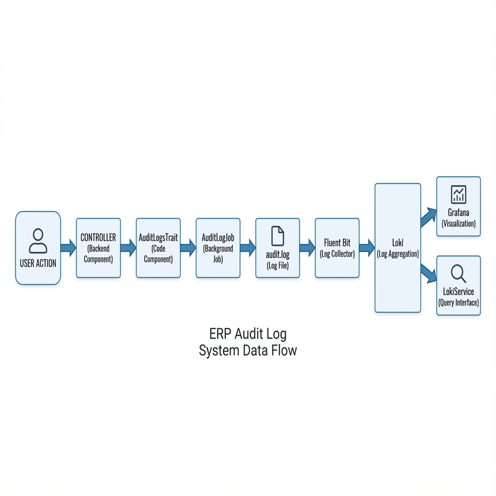

# ERP Audit Log System - Complete Documentation

## Overview

This ERP system implements a centralized logging architecture using **Fluent Bit**, **Loki**, and **Grafana** for collecting, storing, and visualizing audit logs. The system captures detailed audit trails of user actions and system events, making them searchable and analyzable.

The system implements a **4-layer logging architecture**:
1. **Log Generation Layer** (Laravel) - Audit logs generated via queue jobs
2. **Collection Layer** (Fluent Bit) - Tails log files and forwards to Loki
3. **Storage Layer** (Loki) - Centralized log aggregation with multi-tenant support
4. **Query/Visualization Layer** (Grafana + LokiService) - Visual dashboards and programmatic access

---

## Architecture Overview

### Visual Architecture Diagram



### Architecture Flow

```
User Action → Controller → AuditLogsTrait → AuditLogJob → audit.log file → Fluent Bit → Loki → Grafana/LokiService
```

### Architecture Components

#### 1. **Laravel Application (Log Producer)**
- **Location**: `erp/Gears_BackEnd/`
- **Purpose**: Generates structured audit logs for user actions and system events
- **Log Format**: JSON-formatted entries with metadata
- **Key Files**:
  - `app/Jobs/AuditLog/AuditLogJob.php` - Main audit logging job
  - `app/Jobs/AuditLog/AuthAuditLogJob.php` - Authentication audit logs
  - `app/Jobs/AuditLog/NavigationAccessAuditLogJob.php` - Navigation access logs
  - `app/Traits/AuditLogsTrait.php` - Entry point for logging

#### 2. **Fluent Bit (Log Collector)**
- **Version**: 2.1.10
- **Purpose**: Tails log files, parses them, and forwards to Loki
- **Configuration**: `erp/Gears_BackEnd/fluent_bit/fluent-bit.conf`
- **Features**:
  - Real-time log tailing
  - JSON parsing
  - HTTPS forwarding with TLS
  - Label-based filtering

#### 3. **Loki (Log Aggregation)**
- **Purpose**: Centralized log storage and indexing
- **Endpoint**: `loki-cp-dev.gears-int.com:443`
- **Tenant**: `erp`
- **Key Features**:
  - Label-based indexing
  - Efficient storage (separates content from labels)
  - Multi-tenant isolation
  - Time-series optimized queries

#### 4. **Grafana (Visualization)**
- **Purpose**: Query and visualize logs stored in Loki
- **Integration**: Connects to Loki as a data source
- **Features**:
  - Log Explorer
  - Dashboards
  - Alerts
  - Interactive filtering

#### 5. **LokiService (Query Interface)**
- **Location**: `erp/Gears_BackEnd/app/Services/LokiService.php`
- **Purpose**: PHP service to query Loki API from the application
- **Methods**:
  - `getAuditLogs()` - Instant query
  - `getAuditLogsRange()` - Time range query

---

## Part 1: How Logs Are Stored

### Storage Flow

```
User Action → Controller → AuditLogsTrait → AuditLogJob → audit.log file → Fluent Bit → Loki
```

### Step-by-Step Storage Process

#### Step 1: Triggering Audit Log (Controller Level)

When a user performs an action (create, update, delete), the controller uses the `AuditLogsTrait`:

**File**: `app/Traits/AuditLogsTrait.php`

```php
// Example: In ItemMasterAPIController
use App\Traits\AuditLogsTrait;

class ItemMasterAPIController extends AppBaseController
{
    use AuditLogsTrait;
    
    public function update($id, Request $request)
    {
        // ... update logic ...
        
        // Store audit log
        self::auditLog(
            $db,                    // Database name
            $itemId,                // Transaction ID (item ID)
            $tenant_uuid,           // Tenant UUID
            'itemmaster',            // Table name
            'Item updated',          // Narration (translation key)
            'U',                     // CRUD Type: C=Create, U=Update, D=Delete
            $newValue,               // New values array
            $previousValue,          // Previous values array
            $parentID,               // Parent ID (if any)
            $parentTable,            // Parent table (if any)
            $empID                   // Employee ID (optional)
        );
    }
}
```

#### Step 2: AuditLogsTrait Dispatches Job

**File**: `app/Traits/AuditLogsTrait.php`

```php
public static function auditLog($dataBase, $transactionID, $tenant_uuid, $table, 
    $narration, $crudType, $newValue = [], $previosValue = [], 
    $parentID = null, $parentTable = null, $empID = null)
{
    $authEmploeeId = Auth::user() ? Auth::user()->employee_id : null;
    $user = !is_null($empID) ? $empID : $authEmploeeId;
    $tokenId = Auth::user() && Auth::user()->token() ? Auth::user()->token()->id : null;

    // Dispatch queue job
    AuditLogJob::dispatch(
        $dataBase, 
        $transactionID, 
        $tenant_uuid, 
        $table, 
        $narration, 
        $crudType, 
        $newValue, 
        $previosValue, 
        $parentID, 
        $parentTable, 
        $user, 
        $tokenId
    );
}
```

#### Step 3: AuditLogJob Processes and Writes Log

**File**: `app/Jobs/AuditLog/AuditLogJob.php`

**Key Steps:**

1. **Switch Database Context**
   ```php
   CommonJobService::db_switch($db);
   ```

2. **Process Audit Data by Table**
   ```php
   switch ($this->table) {
       case 'itemmaster':
           $data = ItemMasterAuditService::process($auditData);
           break;
       case 'customermaster':
           $data = CustomerMasterAuditService::process($auditData);
           break;
       // ... other tables
   }
   ```

3. **Get Active Languages**
   ```php
   $languages = self::getActiveLanguages(); // Returns ['en', 'ar', 'fr', ...]
   ```

4. **Write Log for Each Language**
   ```php
   Log::useFiles(storage_path() . '/logs/audit.log');
   
   foreach ($languages as $locale) {
       $translatedNarration = AuditLogCommonService::translateNarration(
           $narrationVariables,  
           $this->table,
           $this->crudType,
           $locale,
           $this->parentTable  
       );
       
       $logData = [
           'channel' => 'audit',
           'transaction_id' => (string) $this->transactionID,
           'table' => $this->table,
           'user_name' => $employee ? $employee->empName : '-',
           'role' => $employee ? Employee::getDesignation($employee->employeeSystemID ?? null) : '-',
           'employeeId' => $employee ? $employee->empID : '-',
           'tenant_uuid' => $this->tenant_uuid,
           'crudType' => $this->crudType,
           'narration' => $translatedNarration,
           'session_id' => $accessToken ? $accessToken->session_id : '-',
           'date_time' => date('Y-m-d H:i:s'),
           'module' => 'finance',
           'parent_id' => (string) $this->parentID,
           'parent_table' => $this->parentTable,
           'data' => json_encode($data),  // Changed field data
           'locale' => $locale,
           'company_system_id' => $companySystemId,
           'doc_code' => $docCode,
           'log_uuid' => bin2hex(random_bytes(16)),  // Unique identifier
       ];
       
       Log::info('data:', $logData);
   }
   ```

**Log Configuration** (`config/logging.php`):
```php
'audit' => [
    'driver' => 'daily',
    'path' => storage_path('logs/audit.log'),
    'level' => 'info',
    'days' => 14,
]
```

**Output Format in `storage/logs/audit.log`:**
```
[2025-12-12 12:00:00] local.INFO: data: {"channel":"audit","transaction_id":"12345","table":"itemmaster","user_name":"John Doe","role":"Manager","employeeId":"EMP001","tenant_uuid":"tenant-123","crudType":"U","narration":"Item updated","session_id":"session-abc","date_time":"2025-12-12 12:00:00","module":"finance","parent_id":"","parent_table":null,"data":"{\"itemName\":{\"old\":\"Old Name\",\"new\":\"New Name\"}}","locale":"en","company_system_id":"1","doc_code":"ITEM-001","log_uuid":"a1b2c3d4e5f6..."}
```

#### Step 4: Fluent Bit Collects Logs

**File**: `fluent_bit/fluent-bit.conf`

**Service Configuration:**
```ini
[SERVICE]
    flush        1              # Flush logs every 1 second
    daemon       Off            # Run in foreground
    log_level    info           # Logging verbosity
    parsers_file parsers.conf   # Parser definitions
```

**Input Configuration:**
```ini
[INPUT]
    Name tail                           # Tail plugin to read log files
    Path /var/logs/audit.log           # Path to audit log file
    DB /tmp/logs.db                    # State tracking database
    Mem_Buf_Limit 5MB                  # Memory buffer limit
    Skip_Long_Lines Off                # Don't skip long lines
    Parser json                        # Use JSON parser
```

**Parser Configuration** (`fluent_bit/parsers.conf`):
```ini
[PARSER]
    Name        json
    Format      json
```

**Output Configuration:**
```ini
[OUTPUT]
    name loki                          # Loki output plugin
    match *                            # Match all logs
    labels env=erp-qa                  # Add environment label
    Host loki-cp-dev.gears-int.com    # Loki server hostname
    port 443                           # HTTPS port
    tls on                             # Enable TLS
    tls.verify on                      # Verify TLS certificates
    tenant_id erp                      # Multi-tenancy identifier
```

**How it works:**
1. **Tail Plugin**: Monitors `/var/logs/audit.log` for new lines
2. **State Tracking**: Uses `/tmp/logs.db` to remember position in file (prevents duplicate reads)
3. **Parsing**: Applies JSON parser to extract structured data
4. **Buffering**: Buffers up to 5MB in memory before flushing
5. **Labeling**: Adds `env=erp-qa` label to all logs for filtering
6. **Secure Transport**: Uses HTTPS (port 443) with TLS verification
7. **Multi-tenancy**: Uses `tenant_id=erp` for tenant isolation in Loki
8. **Forwarding**: Sends parsed logs to Loki server

#### Step 5: Loki Stores Logs

Loki receives logs from Fluent Bit and stores them efficiently.

**Server:** `loki-cp-dev.gears-int.com:443`

**Key Features:**
- **Label-based indexing**: Indexes logs by labels (env, tenant_id, etc.)
- **Efficient storage**: Stores log content separately from labels
- **Multi-tenancy**: Isolates logs by tenant_id header
- **Time-series data**: Optimized for time-range queries

**Log Structure in Loki:**
```
Labels: {env="erp-qa", tenant_id="erp"}
Log Line: {"channel":"audit","transaction_id":"12345",...}
Timestamp: 2025-12-12T12:00:00Z
```

---

## Part 2: How Logs Are Queried

### Query Flow

```
Frontend (Angular) → Backend API → LokiService → Loki → Response → Frontend Display
```

### Step-by-Step Query Process

#### Step 1: Frontend Component Opens Modal

**File**: `Gears_FrontEnd/src/app/shared/audit-logs/audit-logs.component.ts`

```typescript
// In item-master.component.ts
auditLogs(item) {
    this.bsModalRefItemLogs = this.modalService.show(AuditLogsComponent, { 
        class: 'modal-xlg' 
    });
    this.bsModalRefItemLogs.content.id = item.itemCodeSystem;  // Transaction ID
    this.bsModalRefItemLogs.content.module = 'item';            // Module name
}
```

#### Step 2: Frontend Makes API Call

**File**: `Gears_FrontEnd/src/app/shared/audit-logs/audit-logs.component.ts`

```typescript
ngOnInit() {
    this.dtOptions = {
        serverSide: true,
        ajax: (dataTablesParameters: any, callback) => {
            dataTablesParameters.companyId = +(this.helperService.getSelectedCompanyId());
            dataTablesParameters.id = this.transactionId;      // Item ID
            dataTablesParameters.module = this.moduleName;      // 'item'
            
            this.itemFinanceCategorySubService
                .getAuditLogs()
                .post(dataTablesParameters)
                .subscribe(resp => {
                    this.logs = resp.data.data;
                    callback({
                        recordsTotal: resp.data.recordsTotal,
                        recordsFiltered: resp.data.recordsFiltered,
                        data: []
                    });
                });
        }
    };
}
```

**Service**: `Gears_FrontEnd/src/app/services/item-finance-category-sub.service.ts`

```typescript
getAuditLogs() {
    return this.restangular.all('auditLogs');  // POST /api/auditLogs
}
```

#### Step 3: Backend API Receives Request

**File**: `app/Http/Controllers/API/AuditTrailAPIController.php`

**Route**: `POST /api/auditLogs`

```php
public function auditLogs(Request $request)
{
    $input = $request->all();
    $env = env("LOKI_ENV");  // e.g., "erp-qa"
    
    // Calculate date range
    $fromDate = Carbon::parse(env("LOKI_START_DATE"));
    $toDate = Carbon::now();
    $diff = $toDate->diffInDays($fromDate);
    
    $locale = app()->getLocale() ?: 'en';
    $uuid = isset($input['tenant_uuid']) ? $input['tenant_uuid']: 'local';
    
    // Get module and ID from request
    $id = $input['id'];           // Transaction ID (e.g., item ID)
    $module = $input['module'];   // Module name (e.g., 'item')
    
    // Map module to table name
    $table = $this->lokiService->getAuditTables($module);
    // 'item' → 'itemmaster'
    
    // Build LogQL query filters
    $transactionIdFilter = ' |= `\"transaction_id\":\"'.$id.'\"`';
    $tableFilter = ' |= `\"table\":\"'.$table.'\"`';
    
    // Query 1: Direct logs (transaction_id + table)
    $params = 'rate({env="'.$env.'"}|= `\"channel\":\"audit\"` |= `\"tenant_uuid\":\"'.$uuid.'\"` |= `\"locale\":\"'.$locale.'\"`'.$transactionIdFilter.$tableFilter.' | json ['.$diff.'d])';
    $params = 'query?query='.$params;
    $data = $this->lokiService->getAuditLogs($params);
    
    // Query 2: Parent logs (parent_id + parent_table)
    $parentIdFilter = ' |= `\"parent_id\":\"'.$id.'\"`';
    $parentTableFilter = ' |= `\"parent_table\":\"'.$table.'\"`';
    
    $params2 = 'rate({env="'.$env.'"}|= `\"channel\":\"audit\"` |= `\"tenant_uuid\":\"'.$uuid.'\"` |= `\"locale\":\"'.$locale.'\"`'.$parentIdFilter.$parentTableFilter.' | json ['.$diff.'d])';
    $params2 = 'query?query='.$params2;
    $data2 = $this->lokiService->getAuditLogs($params2);
    
    // Process and format data...
}
```

#### Step 4: LokiService Queries Loki

**File**: `app/Services/LokiService.php`

**Environment Configuration:**
```env
LOKI_URL=http://loki-cp-dev.gears-int.com/loki/api/v1/
```

**Query Methods:**

1. **getAuditLogs()** - Query logs using instant query
   ```php
   public function getAuditLogs($params)
   {
       $client = new Client();
       $url = env("LOKI_URL");  // e.g., "http://loki-cp-dev.gears-int.com/loki/api/v1/"
       
       // Make HTTP GET request to Loki
       $response = $client->get($url . $params);
       
       $data = json_decode($response->getBody()->getContents(), true);
       
       // Extract JSON from log entries
       $logEntriesAsArrays = array_map(function ($entry) {
           $entry['metric']['log'] = $this->extractJsonFromLog($entry['metric']['log']);
           return $entry;
       }, $data['data']['result']);
       
       // Sort by date_time (newest first)
       usort($logEntriesAsArrays, function ($a, $b) {
           $timestampA = strtotime($a['metric']['log']['date_time'] ?? null);
           $timestampB = strtotime($b['metric']['log']['date_time'] ?? null);
           return $timestampB - $timestampA;
       });
       
       return $logEntriesAsArrays;
   }
   
   private function extractJsonFromLog($logEntry)
   {
       // Extract JSON from log line: "[2025-12-12 12:00:00] local.INFO: data: {...}"
       preg_match('/{.*}/', $logEntry, $matches);
       if (!empty($matches)) {
           return json_decode($matches[0], true);
       }
       return [];
   }
   ```

2. **getAuditLogsRange()** - Query logs over time range
   ```php
   $params = 'query_range?query={env="erp-qa"} | json&start=1702368000&end=1702454400';
   $logs = $lokiService->getAuditLogsRange($params);
   ```

**Example LogQL Query:**
```
rate({env="erp-qa"} 
  |= `"channel":"audit"` 
  |= `"tenant_uuid":"local"` 
  |= `"locale":"en"` 
  |= `"transaction_id":"12345"` 
  |= `"table":"itemmaster"` 
  | json [30d])
```

#### Step 5: Backend Formats Response

**File**: `app/Http/Controllers/API/AuditTrailAPIController.php`

```php
$formatedData = [];

// Process direct logs
foreach ($data as $key => $value) {
    if (isset($value['metric']['log']['data'])) {
        $lineData = $value['metric']['log'];
        $lineData['data'] = json_decode($value['metric']['log']['data']);
        $formatedData[] = $lineData;
    }
}

// Process parent logs
foreach ($data2 as $key => $value) {
    if (isset($value['metric']['log']['data'])) {
        $lineData = $value['metric']['log'];
        $lineData['data'] = json_decode($value['metric']['log']['data']);
        $formatedData[] = $lineData;
    }
}

// Sort by date_time (newest first)
$formatedData = collect($formatedData)->sortByDesc('date_time');

// Remove duplicates by log_uuid
$formatedData = collect($formatedData)->unique('log_uuid')->values()->all();

// Format date_time
$formatedData = collect($formatedData)->map(function ($item) use ($locale) {
    if (isset($item['date_time'])) {
        $item['date_time'] = $this->formatDateTime($item['date_time']);
    }
    return $item;
})->all();

// Return DataTables format
return DataTables::of($formatedData)
    ->addIndexColumn()
    ->make(true);
```

#### Step 6: Frontend Displays Logs

**File**: `Gears_FrontEnd/src/app/shared/audit-logs/audit-logs.component.html`

```html
<table datatable [dtOptions]="dtOptions">
    <thead>
        <tr>
            <th>Amended By</th>
            <th>Amended Date & Time</th>
            <th>Narration</th>
            <th>Type</th>
            <th>View</th>
        </tr>
    </thead>
    <tbody>
        <tr *ngFor="let item of logs">
            <td>{{item?.user_name}}</td>
            <td>{{item?.date_time}}</td>
            <td>{{item?.narration}}</td>
            <td>
                <span class="badge badge-success" *ngIf="item.crudType == 'C'">Create</span>
                <span class="badge badge-warning" *ngIf="item.crudType == 'U'">Update</span>
                <span class="badge badge-danger" *ngIf="item.crudType == 'D'">Delete</span>
            </td>
            <td>
                <a (click)="view(item)">
                    <i class="fa fa-eye"></i>
                </a>
            </td>
        </tr>
    </tbody>
</table>
```

#### Visual Queries (Grafana)

Grafana connects to Loki as a data source and provides:
- **Log Explorer**: Browse and search logs
- **Dashboards**: Visualize log patterns and metrics
- **Alerts**: Set up alerts based on log patterns
- **Filtering**: Interactive filtering by labels and fields

---

## LogQL Query Examples

### Basic Query - All Logs for Environment
```logql
{env="erp-qa"}
```

### Filter by Table
```logql
{env="erp-qa"} | json | table="customermaster"
```

### Filter by CRUD Type
```logql
{env="erp-qa"} | json | crudType="UPDATE"
```

### Filter by User
```logql
{env="erp-qa"} | json | user_name="John Doe"
```

### Query for Item Master Logs
```logql
rate({env="erp-qa"} 
  |= `"channel":"audit"` 
  |= `"tenant_uuid":"local"` 
  |= `"locale":"en"` 
  |= `"transaction_id":"12345"` 
  |= `"table":"itemmaster"` 
  | json [30d])
```

### Query with Filters (Event Tracking)
```logql
rate({env="erp-qa"} 
  |= `"channel":"audit"` 
  |= `"tenant_uuid":"local"` 
  |= `"locale":"en"` 
  |= `"crudType":"U"`           # Filter by CRUD type
  |= `"employeeId":"EMP001"`    # Filter by employee
  |~ `(?i)customer`             # Full-text search
  | json [30d])
```

### Query for Navigation Access Logs
```logql
rate({env="erp-qa"} 
  |= `"channel":"navigation"` 
  |= `"tenant_uuid":"local"` 
  |= `"locale":"en"` 
  |= `"employeeId":"EMP001"` 
  | json [30d])
```

### Time Range Query
```logql
{env="erp-qa"} | json | table="customermaster" | date_time >= "2025-12-01"
```

---

## Log Data Structure

### Stored Log Format
```json
{
    "channel": "audit",
    "transaction_id": "12345",
    "table": "itemmaster",
    "user_name": "John Doe",
    "role": "Manager",
    "employeeId": "EMP001",
    "tenant_uuid": "tenant-123",
    "crudType": "U",
    "narration": "Item updated",
    "session_id": "session-abc",
    "date_time": "2025-12-12 12:00:00",
    "module": "finance",
    "parent_id": "",
    "parent_table": null,
    "data": "{\"itemName\":{\"old\":\"Old Name\",\"new\":\"New Name\"}}",
    "locale": "en",
    "company_system_id": "1",
    "doc_code": "ITEM-001",
    "log_uuid": "a1b2c3d4e5f6..."
}
```

### Query Response Format
```json
{
    "data": [
        {
            "user_name": "John Doe",
            "date_time": "12/12/2025 12:00:00 PM",
            "narration": "Item updated",
            "crudType": "U",
            "data": {
                "itemName": {
                    "old": "Old Name",
                    "new": "New Name"
                }
            }
        }
    ],
    "recordsTotal": 10,
    "recordsFiltered": 10
}
```

### Log Entry Fields

Each audit log contains:
- **Transaction ID**: Unique identifier for the transaction
- **Table name**: Database table being modified
- **CRUD operation**: Create (C), Update (U), or Delete (D)
- **User details**: Name, role, employee ID
- **Timestamp**: Date and time of the action
- **Session ID**: User session identifier
- **Tenant UUID**: Multi-tenant isolation
- **Changed data**: JSON object with old/new values
- **Multi-language support**: Locale-specific narration
- **Company and document identifiers**: Company system ID and document code
- **Log UUID**: Unique identifier for the log entry

---

## Supported Modules/Tables

The system tracks audit logs for these modules:

| Module | Table Name |
|--------|-----------|
| Item Master | `itemmaster` |
| Customer Master | `customermaster` |
| Supplier Master | `suppliermaster` |
| Chart of Accounts | `chartofaccounts` |
| Finance Item Category | `financeitemcategorysub` |
| Asset Finance Category | `erp_fa_financecategory` |
| Chart of Account Config | `chart_of_account_config` |
| Asset Costing | `erp_fa_asset_master` |
| Service Line | `serviceline` |
| Asset Attributes | `erp_attributes` |
| Company Departments | `company_departments` |
| Budget Templates | `budget_templates` |
| Budget Template Columns | `budget_template_columns` |
| Workflow Configuration | `erp_workflow_configurations` |
| Budget Planning | `department_budget_plannings` |

---

## Docker Setup

### Development Environment

**Fluent Bit Container:**

**File:** `fluent_bit/docker-compose.yml`

```yaml
version: '3'

services:
  fluent-bit:
    image: fluent/fluent-bit:2.1.10
    volumes:
      - ./fluent-bit.conf:/fluent-bit/etc/fluent-bit.conf
      - ./../storage/logs/audit.log:/var/logs/audit.log
```

**Volume Mappings:**
- **Configuration**: Maps local `fluent-bit.conf` to container
- **Log File**: Maps Laravel's `storage/logs/audit.log` to `/var/logs/audit.log` in container

---

## Setup Instructions

### Prerequisites
- Docker and Docker Compose installed
- Access to Loki server (`loki-cp-dev.gears-int.com`)
- Laravel application configured

### Step 1: Configure Laravel Logging

Ensure `config/logging.php` has the audit channel configured:

```php
'audit' => [
    'driver' => 'daily',
    'path' => storage_path('logs/audit.log'),
    'level' => 'info',
    'days' => 14,
],
```

### Step 2: Set Environment Variables

Add to `.env`:
```env
LOKI_URL=http://loki-cp-dev.gears-int.com/loki/api/v1/
LOKI_ENV=erp-qa
LOKI_START_DATE=2024-01-01
```

### Step 3: Configure Fluent Bit

Edit `fluent_bit/fluent-bit.conf`:

1. **Update Input Path** (if needed):
```ini
[INPUT]
    Path /var/logs/audit.log  # Ensure this matches your volume mapping
```

2. **Update Output Configuration**:
```ini
[OUTPUT]
    name loki
    Host loki-cp-dev.gears-int.com  # Your Loki server
    port 443
    labels env=erp-qa               # Your environment label
    tenant_id erp                   # Your tenant ID
```

### Step 4: Start Fluent Bit

Navigate to the Fluent Bit directory and start the container:

```bash
cd erp/Gears_BackEnd/fluent_bit
docker-compose up -d
```

### Step 5: Verify Setup

1. **Check Fluent Bit logs**:
```bash
docker-compose logs -f fluent-bit
```

2. **Generate test audit log**:
```php
// In your Laravel application
Log::useFiles(storage_path() . '/logs/audit.log');
Log::info('data:', ['test' => 'message', 'date_time' => date('Y-m-d H:i:s')]);
```

3. **Query Loki** (using LokiService):
```php
$lokiService = new \App\Services\LokiService();
$logs = $lokiService->getAuditLogs('query?query={env="erp-qa"}');
```

### Step 6: Configure Grafana

1. Add Loki as a data source in Grafana
2. Set URL: `http://loki-cp-dev.gears-int.com`
3. Add custom header: `X-Scope-OrgID: erp` (for multi-tenancy)
4. Test connection

---

## Troubleshooting

### Logs Not Appearing in Loki

1. **Check Fluent Bit is running**:
```bash
docker ps | grep fluent-bit
```

2. **Check Fluent Bit logs for errors**:
```bash
docker-compose logs fluent-bit
```

3. **Verify log file exists and has content**:
```bash
docker exec -it <fluent-bit-container> cat /var/logs/audit.log
```

4. **Test Loki connectivity**:
```bash
curl -k https://loki-cp-dev.gears-int.com/ready
```

### Parsing Errors

1. **Check log format** - Ensure logs are valid JSON
2. **Verify parser configuration** in `parsers.conf`
3. **Check Fluent Bit debug logs**:
```bash
# Set log_level to debug in fluent-bit.conf
log_level debug
```

### Query Issues

1. **Verify LOKI_URL** in `.env`
2. **Check tenant_id** matches between Fluent Bit and queries
3. **Verify labels** in LogQL queries match configured labels
4. **Check time range** - Loki only retains logs for configured retention period

---

## Performance Considerations

### Fluent Bit
- **Mem_Buf_Limit**: Set to 5MB to prevent memory issues
- **Flush interval**: 1 second for near real-time forwarding
- **Storage**: Uses `/tmp/logs.db` for state tracking

### Laravel
- **Daily rotation**: Logs rotate daily, kept for 14 days
- **Async jobs**: Audit logging uses queue jobs to avoid blocking requests
- **Multi-language**: Logs generated for each active language

### Loki
- **Label cardinality**: Keep labels low-cardinality (env, tenant_id)
- **High-cardinality data**: Store in log content, not labels
- **Retention**: Configure based on compliance requirements

---

## Security

1. **TLS Encryption**: All communication with Loki uses HTTPS
2. **Certificate Verification**: TLS certificates are verified
3. **Multi-tenancy**: Tenant isolation via `tenant_id` header
4. **Access Control**: Loki server should have authentication enabled
5. **Sensitive Data**: Avoid logging passwords or sensitive PII

---

## Key Components

### Log Storage Components

1. **AuditLogsTrait** (`app/Traits/AuditLogsTrait.php`)
   - Entry point for logging
   - Dispatches `AuditLogJob`

2. **AuditLogJob** (`app/Jobs/AuditLog/AuditLogJob.php`)
   - Processes audit data
   - Writes to `storage/logs/audit.log`
   - Generates logs for each active language

3. **Fluent Bit** (`fluent_bit/fluent-bit.conf`)
   - Tails `audit.log` file
   - Forwards to Loki

4. **Loki** (External server)
   - Stores logs with label indexing
   - Multi-tenant support

### Log Query Components

1. **AuditLogsComponent** (Frontend)
   - Angular component for displaying logs
   - Uses DataTables for pagination

2. **AuditTrailAPIController** (`app/Http/Controllers/API/AuditTrailAPIController.php`)
   - `auditLogs()` - Main query endpoint
   - `userAuditLogs()` - User authentication logs
   - `navigationAccessLogs()` - Navigation access logs

3. **LokiService** (`app/Services/LokiService.php`)
   - Queries Loki API
   - Extracts and formats log data
   - Maps module names to table names

---

## Key Files Reference

| File | Purpose |
|------|---------|
| `fluent_bit/fluent-bit.conf` | Fluent Bit main configuration |
| `fluent_bit/parsers.conf` | Log parsing rules |
| `fluent_bit/docker-compose.yml` | Fluent Bit container setup |
| `app/Services/LokiService.php` | Loki query service |
| `app/Jobs/AuditLog/AuditLogJob.php` | Main audit logging job |
| `app/Traits/AuditLogsTrait.php` | Entry point for logging |
| `app/Services/AuditLog/*AuditService.php` | Table-specific audit processors |
| `app/Http/Controllers/API/AuditTrailAPIController.php` | API endpoints |
| `config/logging.php` | Laravel logging configuration |
| `.env` | Environment configuration |
| `Gears_FrontEnd/src/app/shared/audit-logs/audit-logs.component.ts` | Frontend component |
| `Gears_FrontEnd/src/app/services/item-finance-category-sub.service.ts` | API service |

---

## Quick Reference

### To Store a Log:
```php
use App\Traits\AuditLogsTrait;

self::auditLog(
    $db, $transactionID, $tenant_uuid, 
    'itemmaster', 'Item updated', 'U', 
    $newValue, $previousValue
);
```

### To Query Logs:
```php
// Frontend
this.itemFinanceCategorySubService
    .getAuditLogs()
    .post({ id: itemId, module: 'item', companyId: companyId })
    .subscribe(resp => { ... });
```

### Programmatic Query:
```php
$lokiService = new \App\Services\LokiService();
$params = 'query?query={env="erp-qa"}';
$logs = $lokiService->getAuditLogs($params);
```

---

## Additional Resources

- [Fluent Bit Documentation](https://docs.fluentbit.io/)
- [Loki Documentation](https://grafana.com/docs/loki/latest/)
- [LogQL Query Language](https://grafana.com/docs/loki/latest/logql/)
- [Grafana Documentation](https://grafana.com/docs/grafana/latest/)